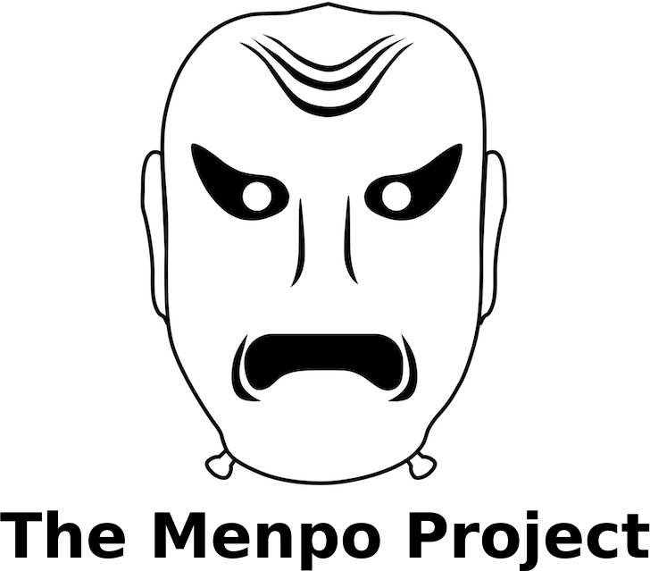
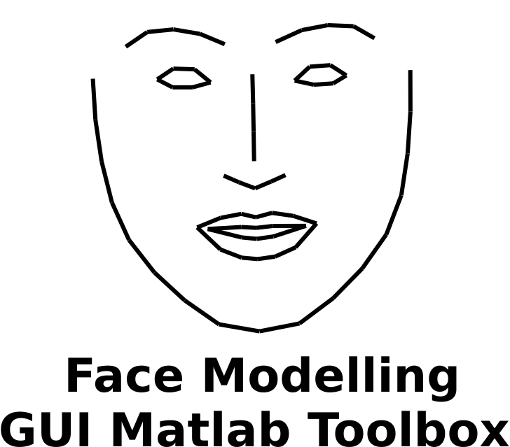
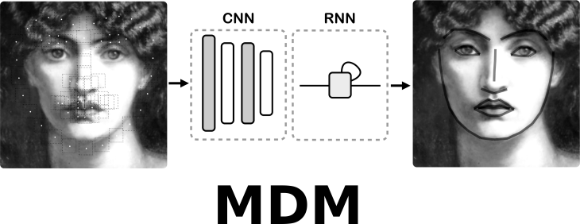
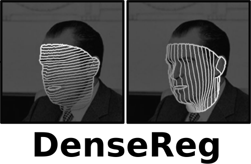

I am a co-founder and main developer of the [**Menpo Project**](/software/menpo_project), the only existing open source platform for deformable modelling.  
In the past, I had also implemented a [**GUI Matlab toolbox**](/software/aam_matlab) for training and fitting Active Appearance Models, face detection, skin detection, deformable tracking and facial events detection.

  
  

### Software maintained by others
[**Mnemonic Descent Method (MDM)**](http://github.com/trigeorgis/mdm), published in CVPR'16, is developed and maintained by [*George Trigeorgis*](http://trigeorgis.com/). 
[**DenseReg**](http://alpguler.com/DenseReg.html), published in arxiv, is developed and maintained by [*Rıza Alp Güler*](http://alpguler.com/).

  
  

