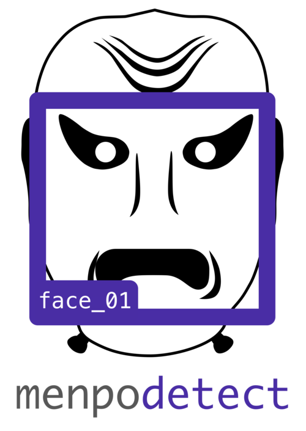
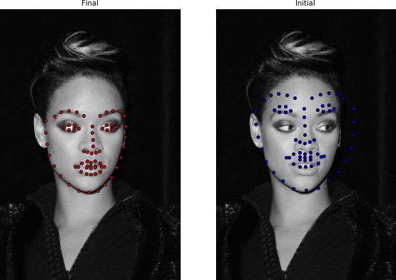
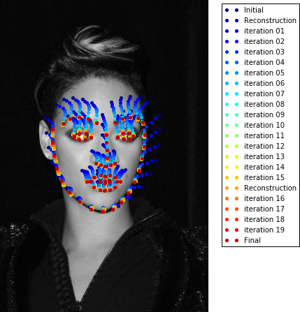

<center><a href="http://www.menpo.org/"></a></center>
<center><a href="http://www.menpo.org/"><strong style="font-size: 200%">The Menpo Project</strong></a></center>

<center>
<a href="http://www.menpo.org/" class="btn">Visit menpo.org</a>
<a href="http://www.menpo.org/" class="btn">Visit github.com/menpo</a>
</center>

---------------------------------------

The Menpo Project is a set of BSD licensed Python frameworks and associated tooling that provide end-to-end solutions for 2D and 3D deformable modeling. The project includes training and fitting code for various state-of-the-art methods such as:

* Active Appearance Model (AAM)
* Supervised Descent Method (SDM)
* Ensemble of Regression Trees (ERT) (powered by [dlib](http://dlib.net/ "dlib C++ Library"))
* Constrained Local Model (CLM)
* Active Shape Model (ASM)
* Active Pictorial Structures (APS)
* Lucas-Kanade (LK) and Active Template Model (ATM)


The Menpo Project also provides:

* a web-based tool for **annotation of bulk data** for model training
* a **command line tool** for landmark localisation with state-of-the-art **pre-trained** models
* generic **object detection** in terms of a bounding box
* an **elegant standard library** with simple dependencies, useful for many areas of computer vision
* sophisticated visualization with **interactive IPython/Jupyter widgets**

All of the code is Open Source and can be found over on the [Menpo Github Organisation](https://github.com/menpo/ "The Menpo Project on Github").

---------------------------------------

## Packages

The Menpo Project consists of a family of packages (primarily Python), each designed to solve one problem well:   
<br />
<div>
<p style="float: left; padding-right: 10px;">
  <a href="/menpo/index.md" title="menpo"></a>
</p>
<p style="text-indent: 0;"><a href="/menpo/index.md" title="menpo"><strong style="font-size: 125%">menpo</strong></a>
The heart of the Menpo Project. <code>menpo</code> contains all core functionality needed for the project in well tested, mature, stable package.
<code>menpo</code> is the <code>numpy</code> of the Menpo ecosystem - the foundation upon which all else is built. Even if you aren't interested
in deformable modelling, <code>menpo</code>'s minimal dependencies and general algorthims and data structures makes it an ideal standalone library
for use in a wide variety of Computer Vision situations.</p>   
</div>
<div style="clear: both;"></div>  
<br />  
<div>
<p style="float: left; padding-right: 10px;">
  <a href="/menpofit/index.md" title="menpofit"></a>
</p>
<p style="text-indent: 0;"><a href="/menpofit/index.md" title="menpofit"><strong style="font-size: 125%">menpofit</strong></a>
Implementations of state-of-the-art 2D deformable models. Each implementation includes training and fitting code.
<code>menpofit</code> contains the crown jewels of the Menpo Project - most people are interested in using the Menpo Project for the
<code>menpofit</code> package.</p>   
</div>
<div style="clear: both;"></div>  
<br />  
<div>
<p style="float: left; padding-right: 10px;">
  <a href="/menpodetect/index.md" title="menpodetect"></a>
</p>
<p style="text-indent: 0;"><a href="/menpodetect/index.md" title="menpodetect"><strong style="font-size: 125%">menpodetect</strong></a>
Wraps a number of existing projects that provide functionalities for training and fitting generic object detection techniques.
It is designed in order to have full compatibility with <code>menpofit</code>. Not all of the wrapped
projects fall under the same BSD license and so care must be taken when using this project to adhere to the sub-project licenses.</p>
</div>
<div style="clear: both;"></div>  
<br />  
<div>
<p style="float: left; padding-right: 10px;">
  <a href="/menpo3d/index.md" title="menpo3d"></a>
</p>
<p style="text-indent: 0;"><a href="/menpo3d/index.md" title="menpo3d"><strong style="font-size: 125%">menpo3d</strong></a>
A specialized library for working with 3D data. It is largely separate from the core <code>menpo</code> library as it has
dependencies on a number of large, 3D specific projects (like <code>VTK</code>, <code>mayavi</code>, <code>assimp</code>) which many people using
the Menpo Project would have no use for. You'll want to install <code>menpo3d</code> if you need to import and export 3D mesh data or perform advanced mesh processing.</p>
</div>
<div style="clear: both;"></div>  
<br />  
<div>
<p style="float: left; padding-right: 10px;">
  <a href="/menpowidgets/index.md" title="menpowidgets"></a>
</p>
<p style="text-indent: 0;"><a href="/menpowidgets/index.md" title="menpowidgets"><strong style="font-size: 125%">menpowidgets</strong></a>
A key goal of the Menpo Project is to accelerate research in 2D and 3D computer vision by providing powerful visualization tools.
<code>menpowidgets</code> contains a collection of Jupyter Notebook Widgets for sophisticated visualization and interactive
inspection of the state of all Menpo objects.</p>
</div>
<div style="clear: both;"></div>  
<br />  
<div>
<p style="float: left; padding-right: 10px;">
  <a href="/menpocli/index.md" title="menpocli"></a>
</p>
<p style="text-indent: 0;"><a href="/menpocli/index.md" title="menpocli"><strong style="font-size: 125%">menpocli</strong></a>
Command Line Interface (CLI) for the Menpo Project that allows to readily use pre-trained
state-of-the-art <code>menpofit</code> facial models. This is useful for people that only care to quickly acquire facial landmarks on their images.</p>
</div>
<div style="clear: both;"></div>  
<br />
<div>
<p style="float: left; padding-right: 10px;">
  <a href="/landmarkerio/index.md" title="landmarker.io"></a>
</p>
<p style="text-indent: 0;"><a href="/landmarkerio/index.md" title="landmarker.io"><strong style="font-size: 125%">landmarker.io</strong></a>
An interactive web-based tool for manual annotation of
2D images and 3D meshes. Useful to quickly landmark a single image, or organize a large annotation effort for thousands of files.
Features like Snap Mode and Dropbox compatibility make it unique.</p>
</div>
<div style="clear: both;"></div>   

---------------------------------------

## Why 'Menpo'?

> Menpo were facial armours which covered all or part of the face and provided
> a way to secure the top-heavy kabuto (helmet). The Shinobi-no-o (chin cord)
> of the kabuto would be tied under the chin of the menpo. There were small
> hooks called ori-kugi or posts called odome located on various places to
> help secure the kabuto's chin cord.
>
> --- [Wikipedia, Menpo](https://en.wikipedia.org/wiki/Mempo)

---------------------------------------

## Code Example
Let's build a facial patch-based Active Appearance Model and fit it on a test image, in order to demonstrate the simplicity of using menpo.

First, let's load the trainset of LFPW (you can download it from [here](http://ibug.doc.ic.ac.uk/resources/facial-point-annotations/)) as:

```python
import menpo.io as mio
from menpo.visualize import print_progress

path_to_images = '/path/to/lfpw/trainset/'

training_images = []
for img in print_progress(mio.import_images(path_to_images, verbose=True)):
    # convert to greyscale
    if img.n_channels == 3:
        img = img.as_greyscale()
    # crop to landmarks bounding box with an extra 20% padding
    img = img.crop_to_landmarks_proportion(0.2)
    # rescale image if its diagonal is bigger than 400 pixels
    d = img.diagonal()
    if d > 400:
        img = img.rescale(400.0 / d)
    # append to list
    training_images.append(img)
```

We can visualize the images using an interactive widget as:

```python
%matplotlib inline
from menpowidgets import visualize_images
visualize_images(training_images)
```
<video width="100%" autoplay loop>
  <source src="visualize_images_lfpw.mp4" type="video/mp4">
Your browser does not support the video tag.
</video>

Let's now train a `PatchAAM` using Dense SIFT features:

```python
from menpofit.aam import PatchAAM
from menpo.feature import fast_dsift

patch_aam = PatchAAM(training_images, group='PTS', patch_shape=[(15, 15), (23, 23)],
                     diagonal=150, scales=(0.5, 1.0), holistic_features=fast_dsift,
                     max_shape_components=20, max_appearance_components=200,
                     verbose=True)
```

and visualize it:

```python
aam.view_shape_models_widget()
```
<video width="100%" autoplay loop>
  <source src="view_shape_models_widget.mp4" type="video/mp4">
Your browser does not support the video tag.
</video>

```python
patch_aam.view_appearance_models_widget()
```
<video width="100%" autoplay loop>
  <source src="patch_aam_view_appearance_models_widget.mp4" type="video/mp4">
Your browser does not support the video tag.
</video>


```python
patch_aam.view_aam_widget()
```
<video width="100%" autoplay loop>
  <source src="patch_aam_view_aam_widget.mp4" type="video/mp4">
Your browser does not support the video tag.
</video>

Let's now create a Lucas-Kanade Fitter for the patch-based AAM using the Wiberg Inverse-Compositional algorithm, as

```python
from menpofit.aam import LucasKanadeAAMFitter, WibergInverseCompositional

fitter = LucasKanadeAAMFitter(patch_aam, lk_algorithm_cls=WibergInverseCompositional,
                              n_shape=[5, 20], n_appearance=[30, 150])
```

You can retrieve information about any trained model by:

```python
print(fitter)
```

Let's load a test image from LFPW testset and convert it to grayscale

```python
from pathlib import Path
import menpo.io as mio

path_to_lfpw = Path('/path/to/lfpw/testset/')

image = mio.import_image(path_to_lfpw / 'image_0018.png')
image = image.as_greyscale()
```

Let's also load a pre-trained face detector from `menpodetect` and try to find the face's bounding box in order to initialize the AAM fitting

```python
from menpodetect import load_dlib_frontal_face_detector

# Load detector
detect = load_dlib_frontal_face_detector()

# Detect
bboxes = detect(image)
print("{} detected faces.".format(len(bboxes)))

# View
if len(bboxes) > 0:
    image.view_landmarks(group='dlib_0', line_colour='red',
                         render_markers=False, line_width=4);
```
<center>
  
</center>

The fitting can be executed as

```python
# initial bbox
initial_bbox = bboxes[0]

# fit image
result = fitter.fit_from_bb(image, initial_bbox, max_iters=[15, 5],
                            gt_shape=image.landmarks['PTS'].lms)

# print result
print(result)
```

which prints

```
Fitting result of 68 landmark points.
Initial error: 0.1689
Final error: 0.0213
```

The fitting result can be visualized as

```python
result.view(render_initial_shape=True)
```
<center>
  
</center>

and the fitting iterations as

```python
result.view_iterations()
```
<center>
  
</center>

Also, fitting result widget can be called as

```python
result.view_widget()
```
<video width="100%" autoplay loop>
  <source src="patch_aam_view_result_widget.mp4" type="video/mp4">
Your browser does not support the video tag.
</video>
